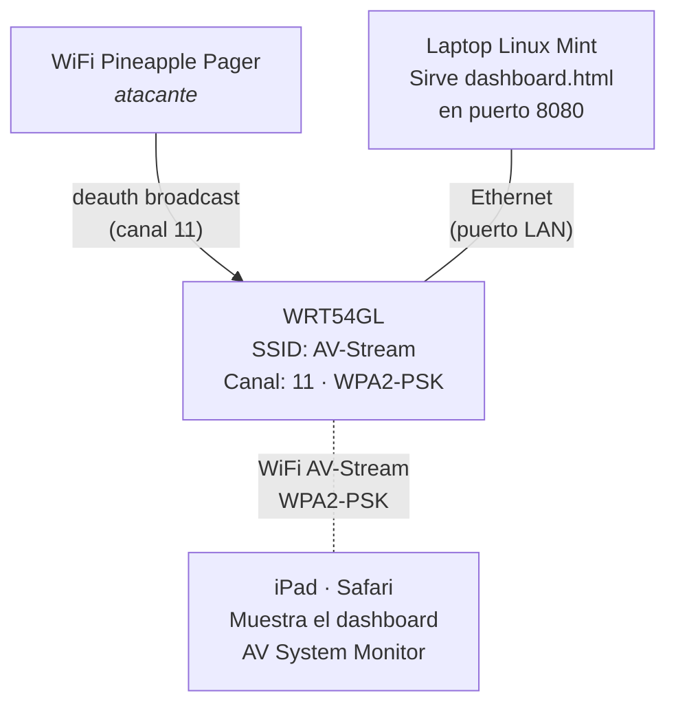

# Demo AV DoS — BICSI-CALA 2026

Demo en vivo (~55 segundos) mostrando **Denegacion de Servicio a un flujo de audio/video** usando el WiFi Pineapple Pager. El Pager ejecuta deauth ciclico (on/off) contra una red AV simulada. Un iPad muestra un dashboard "AV System Monitor" que se congela y recupera dramaticamente con cada ciclo de ataque.

## Que demuestra

- Un atacante con un dispositivo de bolsillo puede interrumpir un stream AV profesional en segundos.
- El cifrado **WPA2 no protege contra deauth** porque los management frames 802.11 no estan cifrados.
- Solo **WPA3 con Protected Management Frames (PMF/802.11w)** mitiga este tipo de ataque.
- El impacto es visible e inmediato: congelamiento total del stream, perdida de senal en el monitor.

## Estructura de archivos

```
demos/demo-av-dos/
├── payloads/
│   └── 1_av_dos_attack/
│       └── payload.sh              <- Payload principal (recon/access_point)
├── stream/
│   ├── dashboard.html              <- Dashboard "AV System Monitor" (autocontenido)
│   └── start_server.sh             <- Lanza Python3 HTTP server en la laptop
└── README.md
```

## Equipamiento necesario

| Dispositivo | Rol | Notas |
|---|---|---|
| **WiFi Pineapple Pager** | Ejecuta el ataque deauth | Firmware actualizado, SD card insertada |
| **Linksys WRT54GL** | Router victima — red AV simulada | Cualquier router WiFi 2.4 GHz sirve |
| **Laptop (Linux Mint)** | Servidor HTTP para el dashboard | Conectada por **Ethernet** al router |
| **iPad Pro** | Muestra el dashboard AV al publico | Conectado por WiFi al router |

## Topologia de red



> **NOTA CRITICA:** La laptop DEBE conectarse por **Ethernet** (puerto LAN del router), no por WiFi. El deauth broadcast desconectaria tambien al laptop si estuviera en WiFi, matando el servidor HTTP y el dashboard.

---

## Paso 1 — Configuracion del router (WRT54GL)

Acceder a la interfaz web del router (por defecto `192.168.1.1`) y configurar:

| Parametro | Valor | Donde |
|---|---|---|
| SSID | `AV-Stream` | Wireless > Basic Settings |
| Canal | `11` (fijo, no Auto) | Wireless > Basic Settings |
| Seguridad | WPA2 Personal (PSK) | Wireless > Wireless Security |
| Contrasena WiFi | `avstream2026` | Wireless > Wireless Security |
| DHCP | Habilitado | Setup > Basic Setup |
| Rango DHCP | `192.168.1.100` a `192.168.1.150` | Setup > Basic Setup |

> **Por que canal 11?** Evita conflicto con canal 6 usado por la Demo Evil Twin. Si solo ejecutas esta demo, cualquier canal funciona.

> **Por que WPA2 y no red abierta?** Es deliberado. Demuestra que WPA2 **no protege contra deauth** porque los management frames 802.11 no van cifrados. Esto refuerza el mensaje educativo.

### Verificacion

1. Desde la laptop, conectar un cable Ethernet al **puerto LAN** del WRT54GL (no al puerto WAN/Internet).
2. Verificar que la laptop obtiene IP via DHCP (deberia estar en rango `192.168.1.x`).
3. Desde el iPad, ir a **Settings > Wi-Fi** y conectarse a `AV-Stream` con contrasena `avstream2026`.
4. Verificar que el iPad obtiene IP (Settings > Wi-Fi > tap en el nombre de la red > ver IP).

---

## Paso 2 — Configuracion de la laptop

### 2.1 Conexion fisica

1. Conectar un cable Ethernet desde la laptop a un **puerto LAN** del WRT54GL.
2. Verificar conectividad:
   ```bash
   ip addr show  # Buscar la interfaz Ethernet con IP 192.168.1.x
   ping 192.168.1.1  # Ping al router
   ```

### 2.2 Verificar Python 3

```bash
python3 --version   # Debe ser 3.x
```

Si no esta instalado:
```bash
sudo apt install python3   # Debian/Ubuntu/Mint
```

### 2.3 Iniciar el servidor del dashboard

```bash
cd demos/demo-av-dos/stream/
chmod +x start_server.sh
./start_server.sh
```

La salida mostrara:
```
=== AV System Monitor — Servidor ===

  Sirviendo desde: /ruta/al/directorio/stream
  Puerto: 8080

  Abrir en el iPad:
    http://192.168.1.XXX:8080/dashboard.html

  Ctrl+C para detener
```

> Anotar la URL que muestra — la necesitaras para el iPad.

### 2.4 Verificar dashboard localmente

Abrir en el navegador de la laptop: `http://localhost:8080/dashboard.html`

Deberias ver:
- Barras de color SMPTE (test pattern de broadcast) animadas
- Estado: **CONECTADO** en verde
- Indicador "EN VIVO" con punto verde parpadeante
- Metricas de latencia, tiempo activo y calidad de conexion
- Reloj en tiempo real

---

## Paso 3 — Configuracion del iPad

1. **Conectar al WiFi:** Settings > Wi-Fi > seleccionar `AV-Stream` > ingresar contrasena `avstream2026`.
2. **Abrir Safari** y navegar a la URL del dashboard:
   ```
   http://192.168.1.XXX:8080/dashboard.html
   ```
   (sustituir `XXX` por la IP real de la laptop que mostro `start_server.sh`)
3. **Verificar que el dashboard muestra:**
   - Estado: **CONECTADO** (verde)
   - Barras SMPTE animadas
   - Calidad: **Excelente — 95%** (aprox.)
4. **Configurar Safari para la demo:**
   - Activar pantalla completa (rotar a landscape, tocar el icono de pantalla completa)
   - Desactivar Auto-Lock: Settings > Display & Brightness > Auto-Lock > **Never**

### Test rapido de conectividad

Para verificar que el overlay de "SENAL PERDIDA" funciona:

1. En el iPad, activar **Airplane Mode** momentaneamente.
2. En ~1-2 segundos, el dashboard debe mostrar el overlay rojo **"SENAL PERDIDA"** con efecto de estatica.
3. Desactivar Airplane Mode.
4. En ~3-5 segundos, debe aparecer un flash verde **"CONECTADO"** y el dashboard vuelve a la normalidad.

Si esto funciona, la demo esta lista.

---

## Paso 4 — Instalacion del payload en el Pager

### 4.1 Conectar al Pager via USB

1. Conectar el WiFi Pineapple Pager a la laptop via cable USB-C.
2. Esperar a que la interfaz de red USB aparezca (IP del Pager: `172.16.42.1`).
3. Verificar conectividad:
   ```bash
   ping 172.16.42.1
   ```

### 4.2 Crear directorio y copiar payload

```bash
# Crear directorio en el Pager
ssh root@172.16.42.1 "mkdir -p /mmc/root/payloads/recon/access_point/av_dos_attack"

# Copiar el payload
scp demos/demo-av-dos/payloads/1_av_dos_attack/payload.sh \
    root@172.16.42.1:/mmc/root/payloads/recon/access_point/av_dos_attack/
```

### 4.3 Verificar en el Pager

```bash
ssh root@172.16.42.1 "cat /mmc/root/payloads/recon/access_point/av_dos_attack/payload.sh | head -10"
```

Debe mostrar el encabezado del payload con el titulo "AV Demo — DoS de Stream AV".

### 4.4 Desconectar USB

Desconectar el cable USB del Pager. El Pager funcionara de forma autonoma con su bateria.

---

## Paso 5 — Ejecucion de la demo en vivo

### Guia para el presentador

> **Tip:** Antes de empezar, mostrar al publico el iPad con el dashboard funcionando normalmente. Explicar que es un "monitor de sistema AV profesional" conectado a una red WiFi AV. Luego sacar el Pineapple Pager del bolsillo.

| Paso | Accion del presentador | Lo que se ve en el Pager | Lo que se ve en el iPad |
|---|---|---|---|
| 1 | Encender el Pager, ir a **Recon** | Lista de redes WiFi cercanas | Dashboard funcionando normal |
| 2 | Seleccionar la red `AV-Stream` en la lista | Muestra info del AP: SSID, BSSID, canal, clientes | Sin cambio |
| 3 | Ejecutar el payload `av_dos_attack` | Muestra resumen: target, ciclos, duracion | Sin cambio |
| 4 | Confirmar "ATACAR STREAM AV?" en el dialogo | **LED ROJO** + vibracion — deauth activo | Sin cambio (aun) |
| 5 | Esperar ~2-3 segundos | Log: "Deauth activo — stream congelado" | **SENAL PERDIDA** — overlay rojo con estatica |
| 6 | Esperar ~10 segundos (ciclo de ataque) | Log: rafaga completada | iPad permanece en "SENAL PERDIDA" |
| 7 | Automatico — fin del ciclo 1 | **LED VERDE** + vibracion — recuperacion | Sin cambio (aun) |
| 8 | Esperar ~3-5 segundos | Log: "Stream reconectando..." | Flash verde **"CONECTADO"** — dashboard vuelve |
| 9 | Esperar ~10 segundos (recuperacion) | Pausa | Dashboard funciona normal |
| 10 | Automatico — ciclo 2 | **LED ROJO** — segundo ataque | "SENAL PERDIDA" de nuevo |
| 11 | Se repiten ciclos | ... | Patron on/off visible |
| 12 | Fin del ultimo ciclo | **LED BLANCO** — ALERT con resumen | iPad reconecta, dashboard normal |

### Narrativa sugerida

- **Antes del ataque:** "Este es un sistema AV profesional conectado a una red WiFi WPA2. Veamos que tan facil es interrumpirlo."
- **Durante ciclo de ataque:** "El stream esta completamente congelado. Ningun paquete de video llega al receptor."
- **Durante recuperacion:** "Al detener el ataque, el dispositivo reconecta automaticamente. Pero observen — puedo volver a atacar."
- **Al finalizar:** "Con un dispositivo que cabe en un bolsillo, interrumpi un sistema AV profesional tres veces en menos de un minuto. WPA2 no protege contra esto. Solo WPA3 con PMF lo mitiga."

---

## Timeline (~55 segundos)

```
t=0s      Confirmar ataque en Pager
t=0s      LED ROJO  -> Ciclo 1 ATAQUE (deauth broadcast sostenido)
t=2-3s    iPad pierde WiFi -> dashboard muestra "SENAL PERDIDA"
t=10s     LED VERDE -> Ciclo 1 RECUPERACION
t=12-15s  iPad reconecta -> dashboard muestra "CONECTADO"
t=20s     LED ROJO  -> Ciclo 2 ATAQUE
t=22-23s  iPad pierde WiFi de nuevo
t=30s     LED VERDE -> Ciclo 2 RECUPERACION
t=32-35s  iPad reconecta
t=40s     LED ROJO  -> Ciclo 3 ATAQUE (ultimo)
t=42-43s  iPad pierde WiFi
t=50s     LED BLANCO -> Demo completado, ALERT con resumen en Pager
t=52-55s  iPad reconecta por ultima vez
```

---

## Parametros ajustables del payload

Estos valores estan al inicio de `payload.sh` y se pueden modificar antes de desplegar:

| Variable | Default | Que controla |
|---|---|---|
| `CYCLE_COUNT` | `3` | Numero de ciclos ataque/recuperacion |
| `ATTACK_DURATION` | `10` | Segundos de deauth sostenido por ciclo |
| `RECOVERY_DURATION` | `10` | Segundos de pausa entre ciclos |
| `BURST_COUNT` | `30` | Paquetes deauth por rafaga |
| `BURST_INTERVAL` | `0.1` | Segundos entre frames deauth dentro de una rafaga |
| `BURST_PAUSE` | `1` | Segundos entre rafagas dentro de un ciclo |

---

## Checklist pre-demo

### Router

- [ ] WRT54GL encendido y configurado: SSID `AV-Stream`, canal 11, WPA2-PSK `avstream2026`
- [ ] DHCP habilitado (rango `192.168.1.100-150`)

### Laptop

- [ ] Conectada al WRT54GL por **cable Ethernet** (puerto LAN)
- [ ] Tiene IP en rango `192.168.1.x` (verificar con `ip addr show`)
- [ ] `python3` instalado
- [ ] `start_server.sh` ejecutandose (terminal abierta, no cerrar)
- [ ] Dashboard visible en navegador local: `http://localhost:8080/dashboard.html`

### iPad

- [ ] Conectado al WiFi `AV-Stream` (contrasena: `avstream2026`)
- [ ] Safari abierto con `http://<laptop-ip>:8080/dashboard.html`
- [ ] Dashboard muestra "CONECTADO" en verde
- [ ] Auto-Lock desactivado (Settings > Display & Brightness > Auto-Lock > Never)
- [ ] Test: toggle Airplane Mode -> overlay aparece en <2s y se recupera en <5s

### WiFi Pineapple Pager

- [ ] Firmware actualizado, SD card insertada
- [ ] Payload copiado a `/mmc/root/payloads/recon/access_point/av_dos_attack/`
- [ ] Pager encendido, Recon muestra la red `AV-Stream`

---

## Troubleshooting

### El iPad no muestra "SENAL PERDIDA" durante el ataque

1. **Verificar canal:** El Pager debe estar en el mismo canal que el router (11). Si el router tiene canal Auto, fijarlo a 11.
2. **Aumentar potencia de deauth:** Editar `payload.sh`, cambiar `BURST_COUNT=30` a `50` o `BURST_INTERVAL=0.1` a `0.05`.
3. **iPad muy cerca del router:** Alejar el iPad del router para que la senal sea mas debil y el deauth sea mas efectivo.

### El iPad no reconecta durante la ventana de recuperacion

1. **Aumentar `RECOVERY_DURATION`:** Cambiar de `10` a `15` o `20` en `payload.sh`.
2. **Reconexion manual:** En el iPad, ir a Settings > Wi-Fi y tocar `AV-Stream`.
3. **Verificar que el iPad tiene Auto-Join activado** para la red `AV-Stream`.

### El dashboard no muestra nada / pagina en blanco

1. **Verificar servidor:** En la laptop, verificar que `start_server.sh` sigue corriendo (la terminal debe estar abierta).
2. **Verificar IP:** La URL en el iPad debe apuntar a la IP Ethernet de la laptop (no la WiFi).
3. **Recargar pagina:** En Safari, pull-down to refresh o tocar la barra de direcciones y Enter.

### El servidor HTTP se cayo

1. Verificar que la laptop sigue conectada por **Ethernet** (no WiFi).
2. Reiniciar: `cd stream/ && ./start_server.sh`

### Los ciclos son demasiado rapidos para la audiencia

Aumentar `ATTACK_DURATION` a `15` y `RECOVERY_DURATION` a `15`. Esto da una demo de ~85 segundos.

---

## Cleanup post-demo

Minimo — solo detener el servidor HTTP:

```bash
# En la laptop: Ctrl+C en la terminal de start_server.sh
```

No hay estado persistente que limpiar. El payload no modifica configuracion del Pager ni del router.

---

## Notas tecnicas

- El **deauth es broadcast** (`FF:FF:FF:FF:FF:FF`) — desconecta a todos los clientes del AP sin necesidad de conocer MACs individuales.
- El dashboard detecta perdida de conexion haciendo `fetch()` cada 500ms al servidor HTTP en la laptop. Cuando el iPad pierde WiFi, el fetch falla con `TypeError` -> 2 fallos consecutivos (~1s) -> overlay "SENAL PERDIDA".
- La diferencia con la Demo Evil Twin: aqui el deauth es **sostenido por tiempo** (no por conteo fijo), impidiendo que el iPad reconecte durante la ventana de ataque. El efecto visual es dramatico: congelamiento total -> recuperacion -> congelamiento.
- Las barras SMPTE en el canvas son un test pattern de broadcast clasico — refuerzan la narrativa AV del demo.
- El archivo `dashboard.html` es completamente autocontenido (cero dependencias externas), compatible con Safari en iPad.
- La laptop usa `python3 -m http.server` como servidor — no requiere instalar nada adicional.
