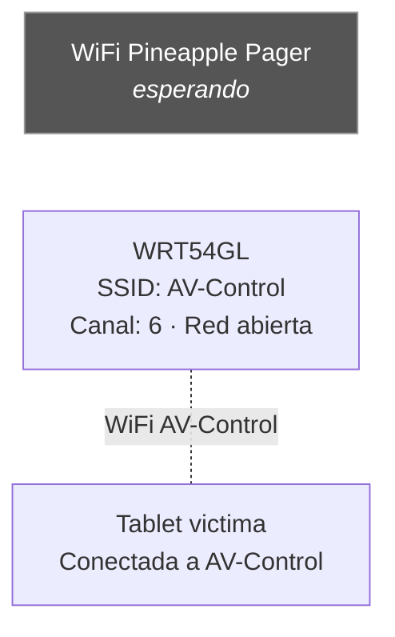
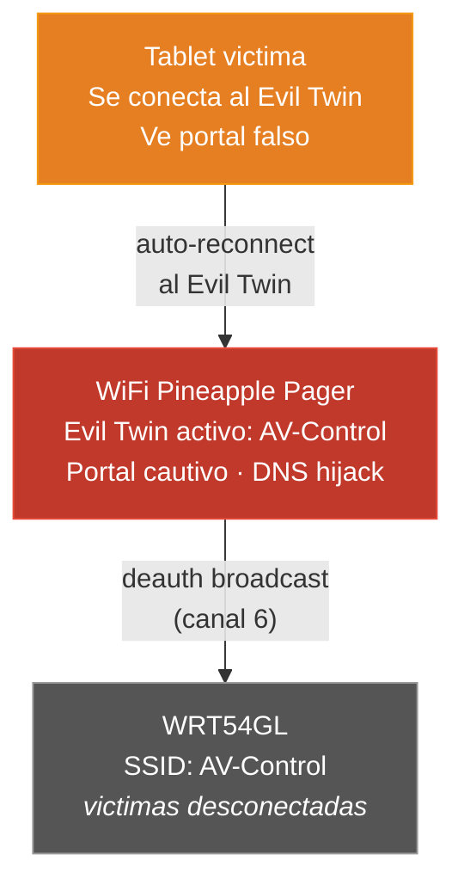

# Demo AV Evil Twin — BICSI-CALA 2026

Demo en vivo (~60 segundos) mostrando **Evil Twin + Portal Cautivo** sobre una red AV simulada. El Pager desautentica a la victima de su red legitima, activa un Evil Twin con el mismo SSID, y sirve un portal que imita el login de un sistema AV profesional (AVIXA AV-over-IP). Las credenciales ingresadas por la victima aparecen en la pantalla del Pager.

## Que demuestra

- Un atacante puede **clonar cualquier red WiFi abierta** y engañar a dispositivos para que se conecten automaticamente.
- Los portales cautivos falsos son indistinguibles de los legitimos para un usuario no entrenado.
- Las credenciales de redes AV (controladores, switches de video, procesadores de audio) pueden ser capturadas en segundos.
- El ataque no requiere romper cifrado — la red AV de demo es abierta, el ataque es **puramente de ingenieria social**.

## Estructura de archivos

```
demos/demo-av-evil-twin/
├── portal/
│   └── index.php                      <- Portal AV (login form + captura de credenciales)
├── payloads/
│   ├── 1_setup_portal/
│   │   ├── payload.sh                 <- Pre-demo setup (requiere internet en el Pager)
│   │   └── whitelist_monitor.sh       <- Monitor de whitelist IP (background daemon)
│   ├── 2_deauth_and_twin/
│   │   └── payload.sh                 <- Deauth + Evil Twin (recon/access_point)
│   └── 3_credential_alert/
│       └── payload.sh                 <- Alerta al conectar victima (pineapple_client_connected)
└── README.md
```

## Equipamiento necesario

| Dispositivo | Rol | Notas |
|---|---|---|
| **WiFi Pineapple Pager** | Ejecuta el ataque (deauth, evil twin, portal) | Firmware actualizado, SD card insertada |
| **Linksys WRT54GL** | Router victima — red AV simulada | Cualquier router WiFi 2.4 GHz sirve |
| **Tablet/laptop victima** | Dispositivo que se conecta al Evil Twin | Auto-Join ON, MAC randomization OFF |

## Topologia de red

### Estado inicial (antes del ataque)



### Durante el ataque



---

## Paso 1 — Configuracion del router (WRT54GL)

Acceder a la interfaz web del router (por defecto `192.168.1.1`) y configurar:

| Parametro | Valor | Donde |
|---|---|---|
| SSID | `AV-Control` | Wireless > Basic Settings |
| Canal | `6` (fijo, no Auto) | Wireless > Basic Settings |
| Seguridad | **Disabled** (red abierta) | Wireless > Wireless Security |
| DHCP | Habilitado | Setup > Basic Setup |
| Rango DHCP | `192.168.1.100` a `192.168.1.150` | Setup > Basic Setup |

> **Por que red abierta?** Este demo simula una red AV de control interno donde la seguridad se "delega" al portal. Muchos sistemas AV reales usan redes abiertas o con PSK compartido para facilitar la integracion de equipos.

> **Por que canal 6?** Es el canal mas comun y funciona bien para la demo. Evita conflicto con canal 11 de la Demo DoS si ambas se ejecutan en la misma sesion.

> **Ubicacion del router:** Idealmente lejos del escenario (senal debil). Esto facilita que el Evil Twin del Pager tenga senal mas fuerte que el router legitimo, asegurando que la victima reconecte al Twin.

### Verificacion

1. Desde la tablet victima, ir a Settings > Wi-Fi.
2. La red `AV-Control` debe aparecer sin icono de candado (red abierta).
3. Conectarse y verificar que obtiene IP (rango `192.168.1.x`).

---

## Paso 2 — Configuracion del dispositivo victima (tablet/laptop)

El dispositivo victima es el que se conectara al Evil Twin durante la demo. Puede ser una tablet (iPad, Android) o un laptop.

### 2.1 Conexion inicial

1. Conectar el dispositivo a la red `AV-Control` del WRT54GL.
2. Verificar que tiene conexion (abrir un sitio web cualquiera).

### 2.2 Configuraciones criticas

| Configuracion | Valor | Por que |
|---|---|---|
| Auto-Join para `AV-Control` | **ON** | Para que reconecte automaticamente al Evil Twin tras el deauth |
| MAC randomization | **OFF** | Algunos dispositivos cambian MAC al reconectar, lo que puede confundir el ataque |
| Auto-Lock | **Never** | Para que la pantalla no se apague durante la demo |

**En iPad:**
- Auto-Join: Settings > Wi-Fi > tap (i) junto a `AV-Control` > Auto-Join **ON**
- MAC randomization: Settings > Wi-Fi > tap (i) junto a `AV-Control` > Private Wi-Fi Address **OFF**
- Auto-Lock: Settings > Display & Brightness > Auto-Lock > **Never**

**En Android:**
- Auto-Join suele estar habilitado por defecto.
- MAC randomization: Settings > Wi-Fi > tap en `AV-Control` > Privacy > Use device MAC

**En laptop:**
- La mayoria de laptops reconectan automaticamente a redes conocidas.
- Verificar que el WiFi no tiene MAC randomization habilitado en el Network Manager.

---

## Paso 3 — Instalacion de payloads en el Pager

Esta demo usa **3 payloads** que se despliegan en distintas ubicaciones del Pager, mas el archivo del portal (`index.php`).

### 3.1 Conectar al Pager via USB

```bash
# Conectar el Pager a la laptop via USB-C
ping 172.16.42.1   # Verificar conectividad
```

### 3.2 Crear directorios en el Pager

```bash
ssh root@172.16.42.1 "mkdir -p \
    /mmc/root/payloads/user/interception/av_demo_setup \
    /mmc/root/payloads/recon/access_point/av_evil_twin \
    /mmc/root/payloads/alerts/pineapple_client_connected/av_credential_alert"
```

### 3.3 Copiar Payload 1 — Setup del portal

Este payload instala nginx + PHP, despliega el portal cautivo y configura firewall + DNS hijack.

```bash
# Copiar payload, whitelist monitor y portal al mismo directorio
scp demos/demo-av-evil-twin/payloads/1_setup_portal/payload.sh \
    demos/demo-av-evil-twin/payloads/1_setup_portal/whitelist_monitor.sh \
    demos/demo-av-evil-twin/portal/index.php \
    root@172.16.42.1:/mmc/root/payloads/user/interception/av_demo_setup/
```

> **Importante:** El archivo `index.php` (portal) debe copiarse al mismo directorio que `payload.sh`. El payload lo busca primero en su propio directorio.

### 3.4 Copiar Payload 2 — Deauth y Evil Twin

Este payload clona el SSID, desautentica clientes y espera credenciales.

```bash
scp demos/demo-av-evil-twin/payloads/2_deauth_and_twin/payload.sh \
    root@172.16.42.1:/mmc/root/payloads/recon/access_point/av_evil_twin/
```

### 3.5 Copiar Payload 3 — Alerta de credenciales

Este payload se dispara automaticamente cuando un cliente se conecta al Evil Twin.

```bash
scp demos/demo-av-evil-twin/payloads/3_credential_alert/payload.sh \
    root@172.16.42.1:/mmc/root/payloads/alerts/pineapple_client_connected/av_credential_alert/
```

### 3.6 Verificar despliegue

```bash
ssh root@172.16.42.1 "echo '=== Payload 1 ===' && \
    ls -la /mmc/root/payloads/user/interception/av_demo_setup/ && \
    echo '=== Payload 2 ===' && \
    ls -la /mmc/root/payloads/recon/access_point/av_evil_twin/ && \
    echo '=== Payload 3 ===' && \
    ls -la /mmc/root/payloads/alerts/pineapple_client_connected/av_credential_alert/"
```

Esperado:
- Payload 1: `payload.sh`, `whitelist_monitor.sh`, `index.php`
- Payload 2: `payload.sh`
- Payload 3: `payload.sh`

### 3.7 Rutas on-device (resumen)

| Payload | Ruta en el Pager | Tipo | Trigger |
|---|---|---|---|
| 1 - Setup Portal | `/mmc/root/payloads/user/interception/av_demo_setup/` | `user/interception` | Manual desde menu |
| 2 - Deauth & Twin | `/mmc/root/payloads/recon/access_point/av_evil_twin/` | `recon/access_point` | Seleccionar AP en Recon |
| 3 - Credential Alert | `/mmc/root/payloads/alerts/pineapple_client_connected/av_credential_alert/` | `alerts` | Automatico al conectarse un cliente |

---

## Paso 4 — Setup pre-demo (ejecutar una vez, requiere internet)

Este paso instala dependencias (nginx, PHP) y configura el portal cautivo en el Pager. Solo se ejecuta **una vez** antes de la demo. Requiere que el Pager tenga conexion a internet.

### 4.1 Conectar el Pager a internet

1. En el Pager, ir a **Settings > Networking > Client Mode**.
2. Conectar el Pager a una red WiFi con acceso a internet.
3. Verificar conexion:
   ```bash
   ssh root@172.16.42.1 "ping -c 2 8.8.8.8"
   ```

### 4.2 Ejecutar Payload 1 desde el Pager

1. En el Pager, navegar a: **Payloads > User > Interception > av_demo_setup**
2. Ejecutar el payload.
3. Esperar a que complete. Deberia mostrar:
   ```
   ================================
   AV Demo Portal Ready!
   ================================

   Portal URL:    http://172.16.52.1/
   Credentials:   /root/loot/av_demo/credentials.log

   Next step: disconnect Pager from internet,
   then run 2_deauth_and_twin from Recon > AV-Control AP
   ```

### 4.3 Verificar el portal

Desde un dispositivo conectado al Pager (por USB o WiFi del Pager):
```bash
curl -s http://172.16.52.1/ | head -5
```
Debe mostrar el HTML del portal "AV Control Network".

### 4.4 Test de captura de credenciales

1. Desde un navegador, ir a `http://172.16.52.1/`
2. Ingresar credenciales de prueba (ej: `test@test.com` / `test123`)
3. Verificar que se registraron:
   ```bash
   ssh root@172.16.42.1 "cat /root/loot/av_demo/credentials.log"
   ```
   Debe mostrar las credenciales de prueba con timestamp.

### 4.5 Limpiar estado de prueba

```bash
ssh root@172.16.42.1 "echo -n > /root/loot/av_demo/credentials.log && \
    rm -f /tmp/av_demo_whitelist.txt /tmp/av_demo_processed.txt"
```

### 4.6 Desconectar el Pager de internet

1. En el Pager, ir a **Settings > Networking > Client Mode** y desconectar.
2. Esto es importante: si el Pager tiene internet, la victima podria navegar a traves de el sin ver el portal.

---

## Paso 5 — Ejecucion de la demo en vivo

### Pre-condiciones

- [ ] Payload 1 ejecutado exitosamente (setup del portal)
- [ ] `credentials.log` vacio (limpiado tras el test)
- [ ] Pager desconectado de internet (Client Mode OFF)
- [ ] WRT54GL encendido con SSID `AV-Control`, canal 6, red abierta
- [ ] Dispositivo victima conectado a `AV-Control` del WRT54GL
- [ ] Payload 3 (credential_alert) cargado en slot `pineapple_client_connected`

### Guia para el presentador

> **Tip:** Antes de empezar, mostrar al publico que el dispositivo victima esta conectado normalmente a una red WiFi llamada "AV-Control". Explicar que simula la red de un sistema de control AV (tipo AVIXA AV-over-IP). Luego sacar el Pineapple Pager.

| Paso | Accion del presentador | Lo que pasa en el Pager | Lo que pasa en la victima |
|---|---|---|---|
| 1 | Encender el Pager, ir a **Recon** | Lista de redes WiFi cercanas | Conectada normal al WRT54GL |
| 2 | Esperar a que `AV-Control` aparezca con al menos 1 cliente | Muestra AP con SSID, BSSID, canal, # clientes | Sin cambio |
| 3 | Seleccionar `AV-Control` > ejecutar payload `av_evil_twin` | Muestra info del AP objetivo | Sin cambio |
| 4 | Confirmar "ATACAR RED AV?" | Evil Twin activo + **LED ROJO** | Sin cambio (aun) |
| 5 | Esperar ~5-10 segundos | Deauth broadcast en progreso | **Victima pierde conexion WiFi** |
| 6 | Automatico | Deauth completado, log muestra exito | Victima reconecta a `AV-Control` **(del Evil Twin, no del router!)** |
| 7 | Automatico | **LED VERDE**, esperando credenciales... | **Portal cautivo aparece:** login "AV Control Network" |
| 8 | Voluntario ingresa usuario y contrasena en el portal | Polling activo en credentials.log | Spinner "Conectando al Sistema AV..." |
| 9 | Automatico (payload 3 + payload 2) | **VIBRA x2** + ALERT: "CREDENCIALES CAPTURADAS!" | Victima es redirigida (whitelist applied) |
| 10 | Mostrar al publico las credenciales en el Pager | LED blanco, credenciales en pantalla | Normal (ya tiene internet via Pager) |

### Narrativa sugerida

- **Antes del ataque:** "Este dispositivo esta conectado a una red llamada AV-Control. En un edificio real, esta red controlaria el audio y video de todo el salon. Veamos que pasa cuando un atacante con este dispositivo de bolsillo decide interferir."
- **Tras el deauth:** "El dispositivo perdio conexion. Pero como tiene Auto-Join habilitado, reconecta automaticamente. Solo que ahora se conecta a MI red, no a la red real."
- **Cuando aparece el portal:** "El dispositivo muestra un portal de login que parece ser del sistema AV. Para el usuario, es indistinguible de un portal legitimo."
- **Tras capturar credenciales:** "En menos de un minuto, tenemos las credenciales del tecnico AV. Con esto, un atacante tendria acceso al sistema de control real."

---

## Parametros ajustables

### Payload 2 — Deauth y Evil Twin (`2_deauth_and_twin/payload.sh`)

| Variable | Default | Que controla |
|---|---|---|
| `POLL_TIMEOUT` | `120` | Segundos maximos esperando credenciales tras deauth |
| `POLL_INTERVAL` | `3` | Segundos entre checks del log de credenciales |
| `BURST_COUNT` | `30` | Paquetes deauth por rafaga |
| `BURST_DELAY` | `1` | Segundos entre rafagas |
| `NUM_BURSTS` | `3` | Numero de rafagas de deauth broadcast |

### Payload 3 — Credential Alert (`3_credential_alert/payload.sh`)

| Variable | Default | Que controla |
|---|---|---|
| `TARGET_SSID` | `AV-Control` | SSID filtro — solo alerta para este SSID |
| `POLL_TIMEOUT` | `60` | Segundos esperando que la victima ingrese credenciales |
| `POLL_INTERVAL` | `2` | Segundos entre checks del log |

> **Si cambias el SSID del router**, recuerda actualizar `TARGET_SSID` en payload 3.

---

## Checklist pre-demo

### Router WRT54GL

- [ ] Encendido y configurado: SSID `AV-Control`, canal 6, red abierta
- [ ] DHCP habilitado (rango `192.168.1.100-150`)
- [ ] Ubicado lejos del escenario (senal debil)

### Dispositivo victima

- [ ] Conectado al WiFi `AV-Control` del WRT54GL
- [ ] Auto-Join ON para `AV-Control`
- [ ] MAC randomization OFF (Private Address OFF en iOS)
- [ ] Auto-Lock desactivado
- [ ] Navegador abierto (cualquier pagina)

### WiFi Pineapple Pager

- [ ] Firmware actualizado, SD card insertada
- [ ] Payload 1 ejecutado exitosamente (portal configurado)
- [ ] Portal verificado: `http://172.16.52.1/` muestra login AV
- [ ] Test de credenciales exitoso
- [ ] Credentials.log limpiado:
  ```bash
  ssh root@172.16.42.1 "echo -n > /root/loot/av_demo/credentials.log && \
      rm -f /tmp/av_demo_whitelist.txt /tmp/av_demo_processed.txt"
  ```
- [ ] Pager **desconectado de internet** (Client Mode OFF)
- [ ] Payload 2 desplegado en `/mmc/root/payloads/recon/access_point/av_evil_twin/`
- [ ] Payload 3 desplegado en `/mmc/root/payloads/alerts/pineapple_client_connected/av_credential_alert/`
- [ ] Recon muestra `AV-Control` con al menos 1 cliente

---

## Troubleshooting

### La victima no reconecta al Evil Twin

1. **Verificar que el router tiene senal debil** (alejar del escenario). Si el router tiene senal mas fuerte que el Pager, la victima reconectara al router legitimo.
2. **Aumentar deauth:** Editar payload 2, cambiar `BURST_COUNT=30` a `50` o `NUM_BURSTS=3` a `5`.
3. **Reconexion manual:** En la tablet victima, ir a Settings > Wi-Fi y seleccionar `AV-Control` manualmente. Deberia conectarse al Evil Twin si la senal del Pager es mas fuerte.
4. **Verificar MAC randomization OFF:** Si la victima tiene Private Address ON, puede obtener una MAC diferente al reconectar.

### El portal cautivo no aparece automaticamente

1. **Abrir cualquier sitio HTTP** en el navegador: `http://neverssl.com` o `http://httpforever.com`. El DNS hijack redirigira al portal.
2. **En iOS:** Si no aparece el popup de captive portal, ir a Settings > Wi-Fi > tap (i) en `AV-Control`. iOS puede detectar el portal al hacer esto.
3. **Verificar DNS hijack:** `ssh root@172.16.42.1 "netstat -plant 2>/dev/null | grep 1053"` — debe mostrar dnsmasq escuchando.
4. **Verificar nginx:** `ssh root@172.16.42.1 "curl -s http://127.0.0.1/ | head -5"` — debe mostrar HTML del portal.

### Timeout sin credenciales (payload 2 muestra "Timeout")

1. **El portal sigue activo.** La victima puede aun estar en el proceso de ingresar credenciales.
2. **Verificar manualmente:**
   ```bash
   ssh root@172.16.42.1 "cat /root/loot/av_demo/credentials.log"
   ```
3. **Si la victima ingreso credenciales pero el payload no las detecto:** Puede que haya habido un delay. Las credenciales estan en el log, solo que el timeout del payload se cumplio antes.

### El Pager no muestra redes en Recon

1. Esperar 10-15 segundos — el scan toma tiempo.
2. Verificar que el router esta encendido y transmitiendo `AV-Control`.

### Error "opkg update failed" al ejecutar Payload 1

1. El Pager no tiene conexion a internet. Verificar Client Mode en Settings > Networking.
2. Verificar DNS: `ssh root@172.16.42.1 "ping -c 2 google.com"`
3. Si el internet es lento, esperar y reintentar. `opkg update` puede tomar 30-60 segundos.

### Error "index.php not found" al ejecutar Payload 1

El archivo `index.php` no se copio junto con `payload.sh`. Copiar manualmente:
```bash
scp demos/demo-av-evil-twin/portal/index.php \
    root@172.16.42.1:/mmc/root/payloads/user/interception/av_demo_setup/
```
Luego re-ejecutar el payload.

---

## Cleanup post-demo

Ejecutar desde SSH al Pager para restaurar estado limpio:

```bash
# 1. Detener procesos de la demo
[ -f /tmp/av_demo-dns.pid ] && kill "$(cat /tmp/av_demo-dns.pid)" 2>/dev/null
[ -f /tmp/av_demo-whitelist.pid ] && kill "$(cat /tmp/av_demo-whitelist.pid)" 2>/dev/null

# 2. Restaurar nginx config original
[ -f /etc/nginx/nginx.conf.av_demo.bak ] && \
    cp /etc/nginx/nginx.conf.av_demo.bak /etc/nginx/nginx.conf
/etc/init.d/nginx restart 2>/dev/null

# 3. Eliminar reglas de firewall AVDemo (loop hasta que no queden)
while uci show firewall 2>/dev/null | grep -q "AVDemo"; do
    idx=$(uci show firewall | grep "AVDemo" | head -1 | sed "s/.*\[\([0-9]*\)\].*/\1/")
    uci delete "firewall.@redirect[$idx]" 2>/dev/null || break
done
uci commit firewall
/etc/init.d/firewall restart

# 4. Restaurar IPv6
sysctl -w net.ipv6.conf.br-lan.disable_ipv6=0 2>/dev/null

# 5. Limpiar archivos temporales
rm -f /tmp/av_demo_whitelist.txt /tmp/av_demo_processed.txt
rm -f /tmp/av_demo-dns.pid /tmp/av_demo-whitelist.pid
rm -f /tmp/av_demo_whitelist_monitor.sh

# 6. Limpiar loot (opcional)
rm -rf /root/loot/av_demo/
```

> **Nota:** El SSID Pool del Evil Twin (paso de SSID clonado) se detiene automaticamente cuando el Pager se apaga o reinicia. Para detenerlo manualmente, usar la interfaz web del Pager o ejecutar un payload que llame `PINEAPPLE_SSID_POOL_CLEAR`.

---

## Notas tecnicas

- El **deauth es broadcast** (`FF:FF:FF:FF:FF:FF`) para no depender del MAC del cliente (que podria estar randomizado).
- El portal **no requiere romper handshake** — la red AV-Control es abierta. El ataque combina deauth (tecnico) con ingenieria social (portal falso).
- La cadena del ataque es: deauth -> victima desconectada -> auto-reconnect al Evil Twin (senal mas fuerte) -> DNS hijack redirige todo a portal -> victima ingresa credenciales -> whitelist applied -> victima tiene internet (a traves del Pager).
- El `whitelist_monitor.sh` aplica reglas `nftables` en memoria (`nft insert rule inet fw4 ...`) para dar internet al cliente tras capturar credenciales. Estas reglas son temporales y se pierden al reiniciar.
- Las credenciales se almacenan en `/root/loot/av_demo/credentials.log`. El monitor crea backups con timestamp en el mismo directorio sin truncar el archivo original (los payloads 2 y 3 dependen de este archivo para detectar credenciales nuevas).
- El payload 3 (`credential_alert`) filtra por SSID `AV-Control` via `$_ALERT_CLIENT_CONNECTED_SSID` para evitar falsos positivos con otros clientes conectados al Pineapple.
- Tras el submit del portal, la victima ve un spinner "Conectando al Sistema AV..." con barra de progreso. En segundo plano, un script intenta cargar una imagen de Google. Cuando el whitelist monitor habilita el acceso a internet para esa IP, la imagen carga exitosamente y la pagina redirige a `google.com`.
- Los payloads 2 y 3 pueden disparar alertas de credenciales de forma independiente (no se interfieren). Ambos polleando el mismo archivo de log.
- El payload 1 respalda la configuracion original de nginx en `/etc/nginx/nginx.conf.av_demo.bak` para facilitar el rollback post-demo.
